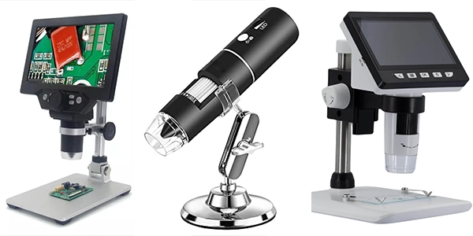

# DMView
A Digital Microscope Output Viewer for macOS - Allows you to connect your digital microscope via USB to your Mac and see the output live

If you have one of those cheapo USB Digital Microscopes, with or without a dedicated screen, most of them can connect to a computer as "PC Camera" or "USB Mode". 

The microscope is just a glorified webcam on USB, but they never come with any software, so I made this tool to allow you to connect to the camera of the microscope and see what it sees LIVE. 

## Features:

* See the microscope view LIVE
* Record video from the microscope
* Snap pictures from the microscope
* Digital Zoom up to 8x

If you have a microscope similar to those below, there is a high chance it shows up as a USB Camera to your Mac so you'd be able to use this tool. Simply pick the microscope from the dropdown in the menu of the app. Camera permission is required by the app to access the devices.

<h2 align="center">Example Microscopes</h2>

  

## Get in touch
* Twitter: @FCE365 (https://twitter.com/FCE365)
* YouTube Channel (iOS/macOS related): http://youtube.com/@idevicecentral
* GeoSn0w's Blog: (https://geosn0w.com)
